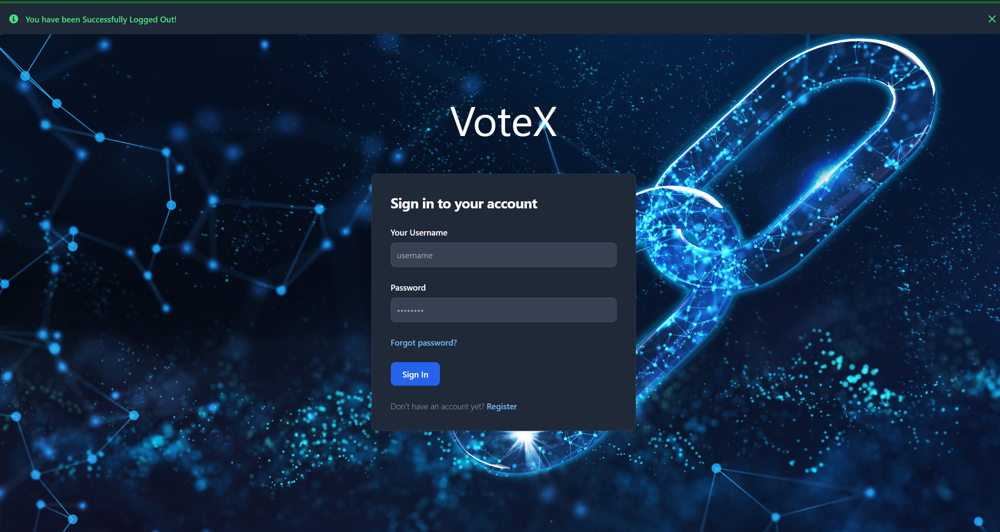
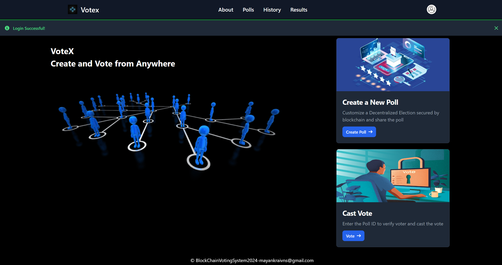
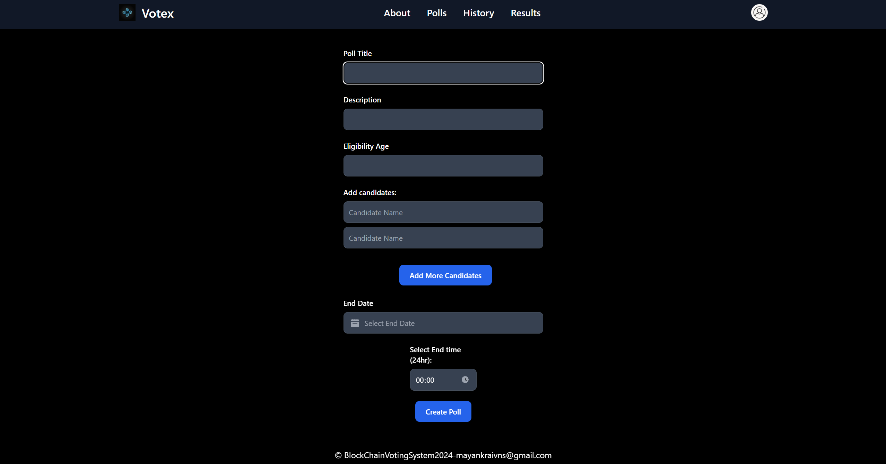

# VoteX

## About This Project

Welcome to the Blockchain-Based Voting System repository! This project aims to implement a secure and transparent voting system using blockchain technology. While the repository currently offers a simple voting system with basic features, such as poll creation, voting, and result viewing, please note that the blockchain features are planned for future implementation and are not yet available.









I am actively working on integrating blockchain technology into the voting system to enhance security, transparency, and trust in the electoral process. Stay tuned for updates as I continue to develop and refine the project.

Your feedback and contributions are highly appreciated as I work towards building a robust and reliable blockchain-based voting solution.

Thank you for your interest in the Blockchain-Based Voting System project!

## Introduction
Welcome to the Voting System VoteX! This document provides an overview of the features, setup instructions, and usage guidelines for the Voting System application.

## Features
1. **Poll Creation**: Users can create polls with titles, descriptions, and options for voting.
2. **Real-Time Voting**: Users can vote on the available options in a poll.
3. **Poll Results**: Users can view the results of a poll, including the number of votes for each option.
4. **Authentication**: JWT Authentication is implemented to ensure that only authorized users can create and vote on polls.

## Setup Instructions
Follow these steps to set up the Voting System locally:

1. **Clone Repository**: Clone the repository to your local machine using Git.

```bash
 git clone https://github.com/Mayankrai449/Blockchain-voting-system
 ```

2. **Navigate to Directory**: Change your directory to the cloned repository.

```bash
cd blockchain-voting-system
```

3. **Install Dependencies**: Install the required Python dependencies using pip.

```bash
pip install -r requirements.txt
```

4. **Set Environment Variables**: Configure any necessary environment variables, such as database connection strings or authentication tokens, in a `.env` file.

5. **Run the Application**: Start the FastAPI server to run the application.

```bash
uvicorn main:app --reload
```

or

Run the main.py file

6. **Access the Application**: Access the Voting System application in your web browser at the LocalHost set in main.py.

## Usage Guidelines
1. **Creating a Poll**:
- Login with your Username and Password.
- On User Dashboard, Click on the "Create Poll" button.
- Fill in the required details such as title, description, options, etc.
- Submit the form to create the poll.

2. **Voting on a Poll**:
- Only the people who have a valid Poll-ID are eligible to vote.
- Click on Vote button on Dashboard.
- Enter the Poll ID and click Goto Poll.
- Select your desired candidate and click on Vote.

3. **Viewing Poll Results**:
- After the Poll ends, you can view the results of a poll.
- Navigate to the Result tab on the Navbar.
- Select the poll to view it's result.

4. **Authentication**:
- To create a poll or vote on a poll, users need to authenticate.
- Use the provided authentication mechanism to log in or register as a new user.


## Support
For any inquiries or assistance, please contact mayankraivns@gmail.com

Thank you for using the Votex!

## Work in Progress

Please note that the Voting System application is still a work in progress. While it currently offers a range of features, there may be areas that are under development or require further refinement. Your feedback and contributions are highly appreciated as I continue to improve and expand the functionality of the application.

If you encounter any issues, have suggestions for new features, or would like to contribute to the project, please feel free to open an issue or submit a pull request on GitHub.

Thank you for your interest in the Voting System project and look forward to collaborating with the community to make it even better!


